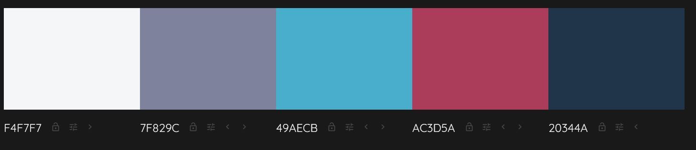

# Odd Art History

### Table of contents:

[Purpose](#purpose)

[User Stories](#user-stories) 

[UX Considerations](#ux-considerations) 

[Wireframes](#wireframes)

[Design colour schemes and typography](#design-colour-schemes-and-typography)

[Features](#features)

[Technologies](#technologies)

[Testing ](#testing)

[Debugging and known bugs](#debugging-and-known-bugs)

[Deployment](#deployment)

[Credits](#credits)

## Purpose

The purpose of the site is to provide interesting information about art history, specifically older paintings. The information is aimed to be presented to users who may consider the topic boring or uninteresting, or interested users who are looking for something new.
The site was built to fulfill the requirements of Project Portfolio 1 for the Code Institute’s Diploma in Software Development.

It can be found here:

[Odd Art History](https://elyserh.github.io/odd-art-history/)

## User Stories

A first time visitor who is new to art history and comes looking for information
* I want to easily understand the content and layout of the site 
* I want to intuitively navigate the site to browse content
* I want to be able to access and use the website as intended on any device
* I want to view interesting information on paintings 
* I want to find further information and non-academic resources

A first time visitor who is already interested in the field and comes to the site looking for something different to the usual academic information (such as Jstor.org):
* I want to easily understand the content and layout of the site
* I want to intuitively navigate the site to browse content
* I want to be able to access and use the website as intended on any device
* I want to view interesting information on paintings
* I want to find further information and non-academic resources
* I want to view sources for information if needed

A returning visitor wishing to contribute to the site:
* I want to to suggest a painting or artwork to be featured
* I want to be able to contact the site owner

A disabled user who is new or returning to the site:
* I want to be able to access and use the site in the same way as any of the aforementioned users

As the owner of the site:
* I want users to be able to use the site easily and intuitively
* I want users to be introduced to something new and fun
* I want users to be able to contact me to suggest paintings or just to get in touch
* I want to provide the same experience for all users

## UX Considerations

For part of the site I used a hub and spoke design, with the Gallery (landing) page as the hub and the 3 painting pages as spokes. These pages do not appear on the navigation bar but can only be accessed from the links on the Gallery page.
The reason for this design for the paintings is to bring a sense of playfulness to the website. It would be simple to add in nav links for each painting, either with the painting title or their ‘hint’ word (heels, bushes, balloon), but I feel this would take away from the intrigue and mystery of discovering information about the paintings.

I have included the Gallery, Odd Resources and Suggestions page on the nav bar so that the rest of the site is still clear and simple to navigate, as I don’t want the users to be frustrated or overloaded. I would like to introduce a small amount of playfulness and intrigue but not so much that it becomes tiring or frustrating.

## Wireframes

Wireframes were produced using Balsamiq. Ultimately the final site followed the broad strokes of the designs but some key points differed, such as the desktop view being center aligned instead of left aligned. I decided that a left aligned page on a simple desktop site was reminiscent of the websites from the 90s, and that a center aligned site has a more modern feel. The mobile and tablet views were already center aligned as this visually makes more sense and is more common on a smaller viewport.

  

  

  

  

## Design colour schemes and typography

I used colormind.io to choose a colour scheme, and Google Fonts for the typography. 

  

I ended up altering the colour scheme a little as the light blue I originally chose did not have a high enough contrast with the text. #49AECB was replaced with #8FDCF1 using the Gitpod dropper tool. I chose a scheme with one red accent, to mirror Louis XIV’s heels in Rigaud’s portrait.

For the fonts, Lato is used for the headings/titles and Merriweather for the main content, with back-ups provided for both.

## Features

Features across all pages
* Clear header and site ‘slogan’, making the purpose clear to users of the site.
* Navigation bar listing Gallery, Odd Resources, Suggestions and Say Hi (which will link to Facebook), allowing for easy navigation of site for all users.
* Footer mirroring design of navigation bar, which will link back to top of page.
* Header will always remain at top of page and footer will always remain at bottom of page as user scrolls in order to allow for maximum view of visual content. The main purpose of the footer will be to link to the top of the page, so that the user does not have to scroll back up.

Gallery (home/landing page)
* Three main images that link to painting pages - each one is a ‘hint’ of the painting, with a hint word and hint image. The aim of the images is to make the user curious about the content.
* Images are page width on all devices with the hint word as a link to the painting page.

Painting pages (x3, ‘heels’, ‘bushes’, ‘balloons’)
* Spokes from gallery hub (design choice explained in UX section of readme).
* Full view of painting with label, when clicked on will change to close up of detail talked about in text.
* Text about painting with link back to gallery page for easy navigation, deliberately providing multiple ways to return to the landing page
* Links to image and text references clearly provided, with icons from Fontawesome as added visual cues.

Suggestions page
* Easy to use form for users to suggest paintings - make it simple for users to submit paintings
* Placeholder text instead of labels to make form neat and tidy; aria labels with same text for accessibility.
* Optional to provide contact details (theoretically if site user chooses a  painting, they would contact the user and ask if okay to use their name, or possibly for more info).

Odd Resources page
* Page with links to further information - hopefully the site will have piqued the user's interest in weird art history and a easy-to-find page of further information will help them on their journey.
* There will be an embedded video, as a teaser for one of the resources; it will not autoplay and will be muted.

## Technologies

Languages used:
* HTML5
* CSS

Frameworks, Libraries and Programs Used:
* Google Fonts - for the typography
* Colormind.io - for the colour scheme
* Wikimedia Commons - for the painting images
* TinyJPG - for compressing the larger images
* Balsamiq - for creating the wireframes in the design stage
* Google Chrome Developer Tools and Firefox Developer Tools - for inspecting and testing the site
* GitHub - for hosting the site
* GitPages - for the deployment of the site
* Gitpod - for editing the files
* Font Awesome - for the icons used under the main text on the painting pages

## Testing

## Debugging and known bugs

## Deployment

The project was deployed using GitHub pages. The steps to deploy using GitHub pages are:
* In the repository, click the 'Settings' tab, which is the furthest to the right
* Scroll down until you see the 'Pages' tab, which will be in the menu on the left hand side
* Underneath the 'Source' heading, open the drop down and choose the 'master' branch to buid from
* Click 'Save' and the site will be link will appear in a blue box. After a few moments the box will turn green and then the site will be live.

The live link is:

[Odd Art History](https://elyserh.github.io/odd-art-history/)

## Credits

Images

All images were taken from Wikimedia commons and are free to use. References are provided on each page. The gallery page uses the same source image as the painting pages.

Content

Much of the content comes from my own knowledge as an Art History major at the University of Sydney but has been researched for accuracy and references are listed on each page.